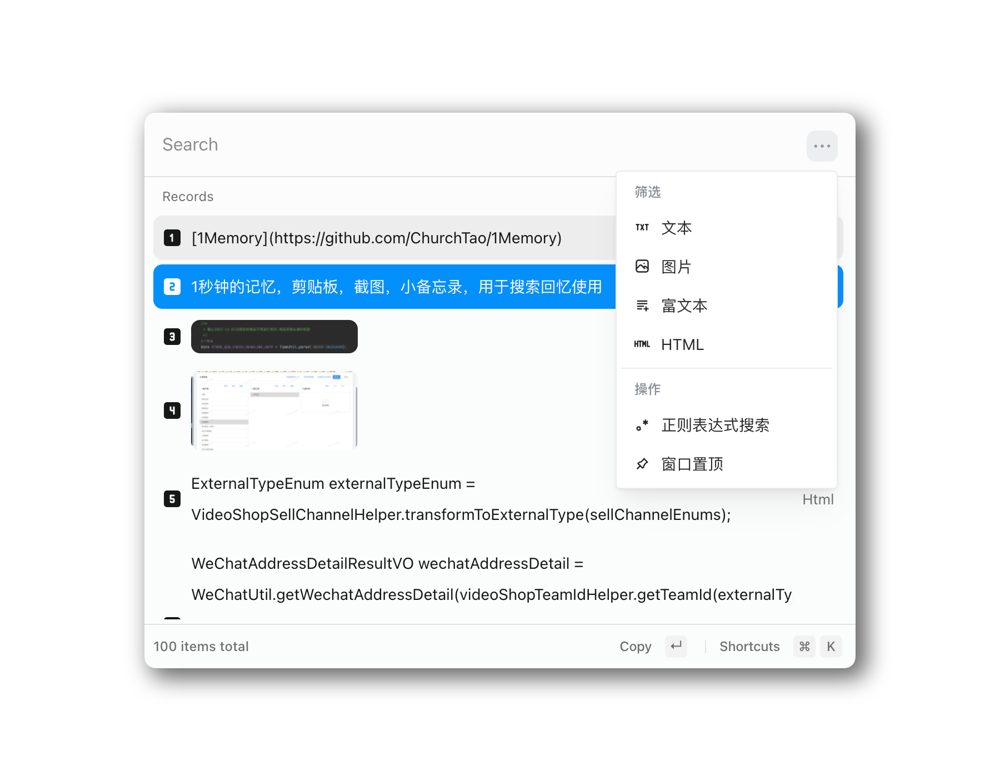

<h1 align="center">
  
</h1>

# [1Memory](https://github.com/ChurchTao/1Memory)

[1Memory](https://github.com/ChurchTao/1Memory) 是一个基于 [Electron](https://www.electronjs.org/) 开发的桌面应用，用于记录剪贴板、截图、小备忘录，用于搜索回忆使用。使用 [TypeScript](https://www.typescriptlang.org) 和 [React](https://reactjs.org/) 编写。

<picture>
  
</picture>

## 下载

从 [release](https://github.com/ChurchTao/Lanaya/releases) 中下载.

### Mac 用户

如果提示`软件已损坏，请移到废纸篓`，可以使用命令 `xattr -cr /Applications/1Memory.app` 解决

## 开发

你需要安装 `Nodejs`

```shell
yarn
yarn dev
```

## 建议

👏🏻 非常欢迎提`Issue`和`PR`！毕竟一个人的力量有限。

## 技术栈

`1Memory` 基于如下技术栈：

- [electron](https://www.electronjs.org/zh/docs/latest): Electron是一个使用 JavaScript、HTML 和 CSS 构建桌面应用程序的框架。 嵌入 Chromium 和 Node.js 到 二进制的 Electron 允许您保持一个 JavaScript 代码代码库并创建 在Windows上运行的跨平台应用 macOS和Linux——不需要本地开发 经验。
- [vitejs/vite](https://cn.vitejs.dev/): 下一代的前端工具链
- [react](https://react.docschina.org/learn/installation): 用于构建用户界面的 JavaScript 库

## License

Apache-2.0 license. See [License here](./LICENSE) for details.
